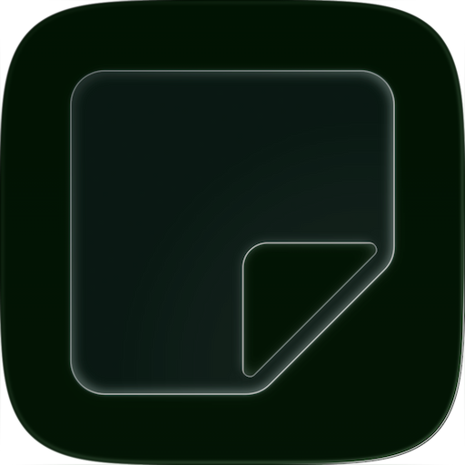

<p align="center">
  
</p>

<h1 align="center">Liquid Composer</h1>

<p align="center">Design Liquid Glass app icons in the browser.</p>

<p align="center"><a href="https://liquid-composer.vercel.app"><b>liquid-composer.vercel.app</b></a></p>

Liquid Composer is a web recreation of Apple's Icon Composer, the tool behind the Liquid Glass icons of iOS 26 and macOS Tahoe. Drop in your artwork, stack it in layers, and the engine renders the glass material in real time: frosted background blur, translucency, edge refraction, specular highlights and background-aware shadows, composited inside the iOS squircle at 1024×1024.

Rendering runs on a WebGL2 pipeline. Two separable Gaussian blur passes feed a glass composite shader with Fresnel rim lighting, chromatic aberration and ACES tone mapping. When WebGL2 isn't available, a Canvas 2D fallback reproduces the same passes.

## Features

- Layer-based editing with groups, drag-and-drop reordering and inline rename
- SVG, PNG and JPEG import. SVGs are re-rasterized at high resolution so edges stay crisp
- Per-layer glass controls: translucency, specular, shadow, blend mode, solid or gradient fill
- The three appearance modes from Icon Composer: Default, Dark and Clear
- Adjustable light angle, with glass-on-glass compositing between stacked layers
- Background editor driven by hue, tint and brightness, or custom gradient stops
- Safe-area overlay on the Apple HIG 70% guide, snap guides, alpha-aware layer picking on canvas
- PNG export at 1024×1024. Work is autosaved locally to localStorage and IndexedDB

## Getting started

```sh
npm install
npm run dev      # http://localhost:1009
npm run build    # production build in dist/
```

## How it works

The editor is Vite, React 18, Tailwind and Nanostores. The engine lives in `src/engine/`:

- `IconRenderer.ts` orchestrates compositing: per-layer caching, drop shadows, bevels and the Canvas 2D passes
- `LiquidGlass.ts` is the WebGL2 renderer, running ping-pong framebuffers over RGBA16F for an HDR pipeline
- `shaders/` holds the GLSL ES 3.00 sources for the blur and glass composite passes
